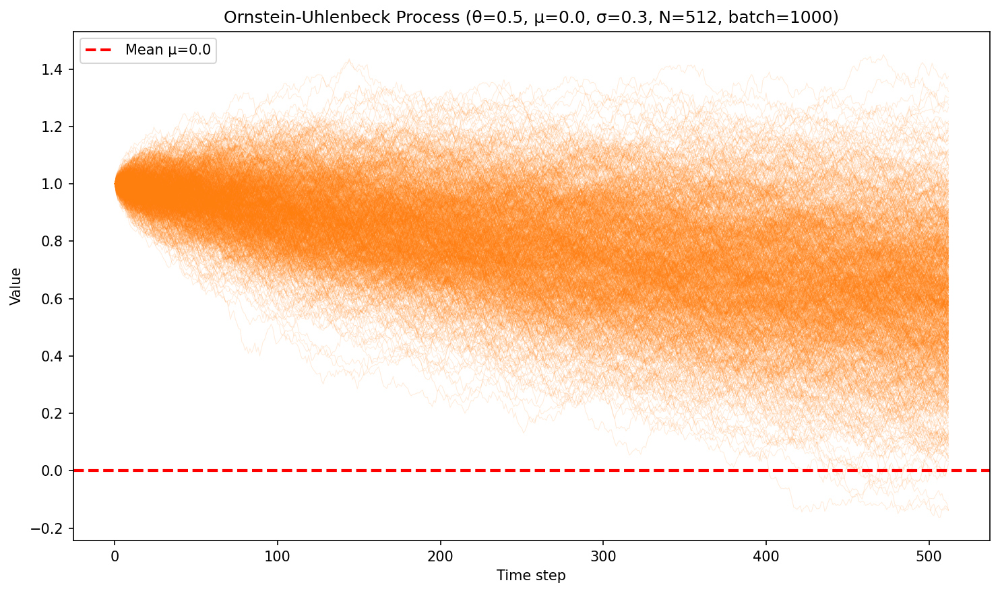
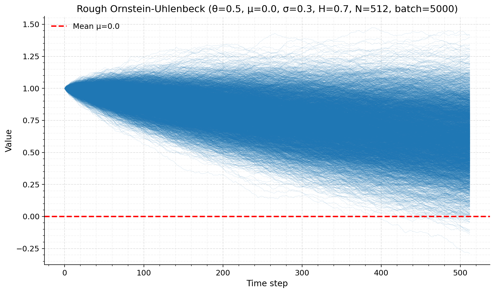
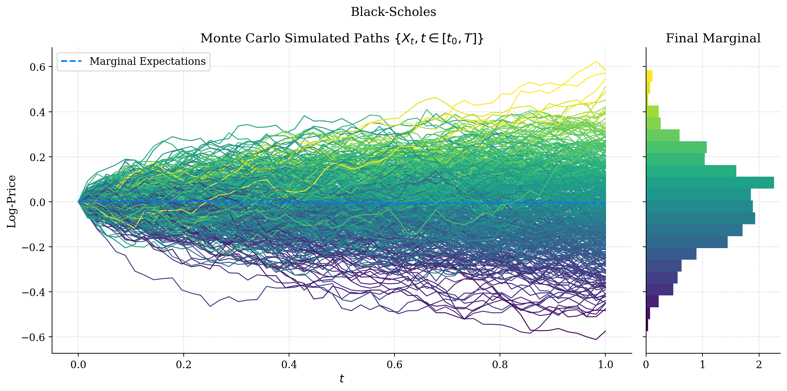
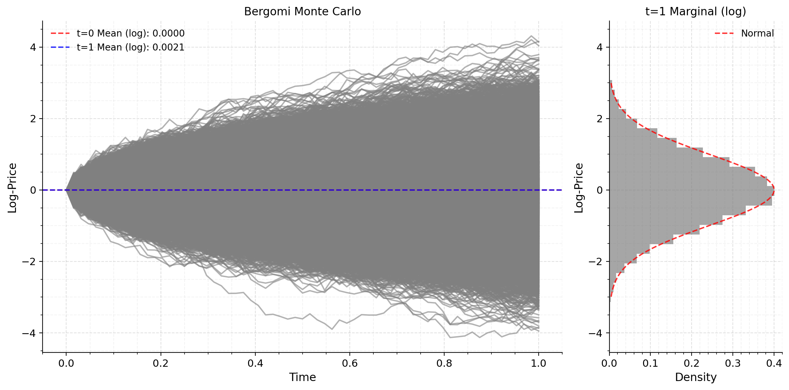
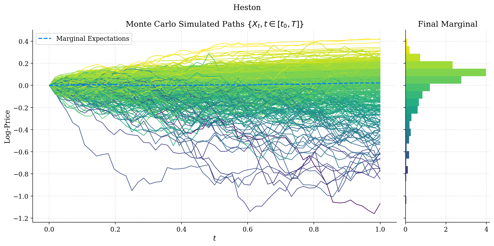
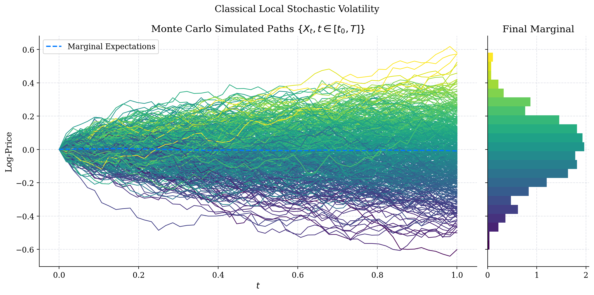
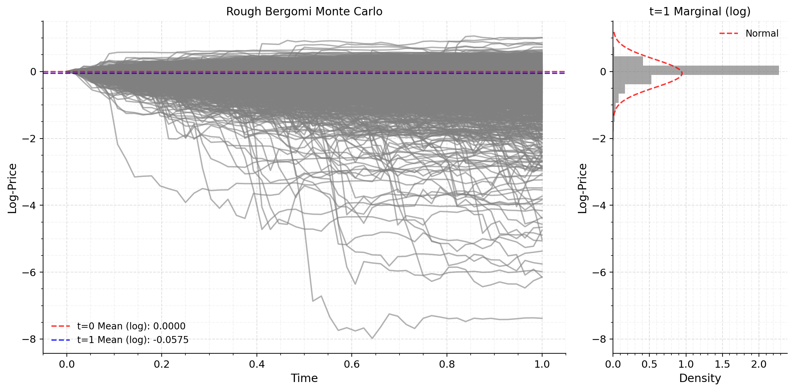
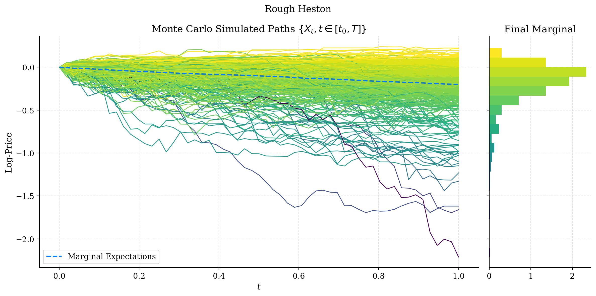
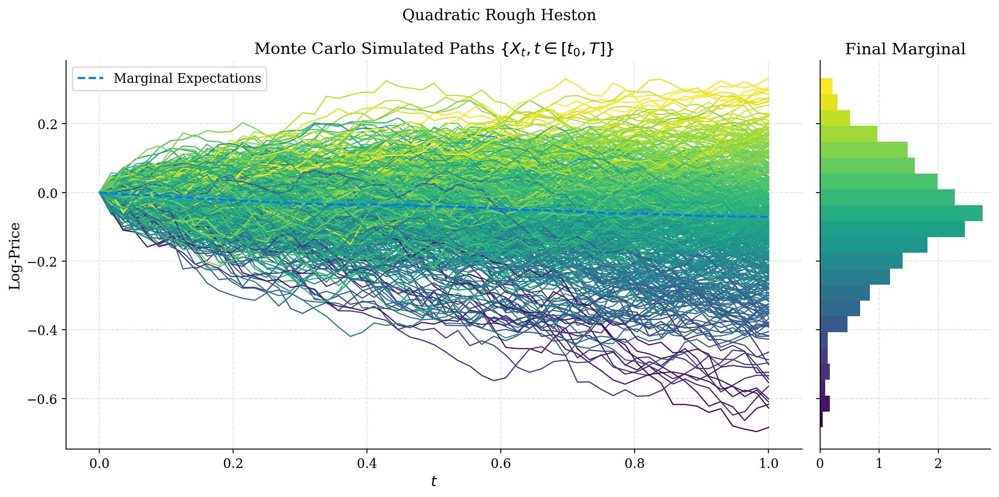

# RoughBench

**RoughBench** is a benchmark dataset for machine learning on rough differential equations, implemented in JAX via the [Bonesini et al.](https://arxiv.org/abs/2407.09003) Wong-Zakai RDE framework.

## Installation

```bash
pip install "roughbench @ git+https://github.com/luke-a-thompson/RoughBench.git"
```

> **Note:** RoughBench depends on [Stochastax](https://github.com/luke-a-thompson/Stochastax) and JAX with CUDA support. Ensure your JAX installation matches your CUDA version before installing.

## Quick Start

### Python API

```python
import jax
from roughbench.rde.rough_volatility import (
    make_bergomi_model_spec,
    get_bonesini_noise_drivers,
    solve_wong_zakai,
)

model_spec = make_bergomi_model_spec(v_0=0.04, rho=-0.7)

keys = jax.random.split(jax.random.PRNGKey(42), 128)
y0s, Xs, Ws = jax.vmap(
    lambda k: get_bonesini_noise_drivers(k, noise_timesteps=256, model_spec=model_spec, s_0=1.0)
)(keys)
solutions = jax.vmap(
    lambda y0, X, W: solve_wong_zakai(y0, X, W, model_spec, noise_timesteps=256, rde_timesteps=768)
)(y0s, Xs, Ws)

# solutions.ys — shape (128, 257, 2): [paths, timesteps, (price, vol_state)]
prices = solutions.ys[:, :, 0]
```

### CLI — Generating Data from a Config

Each model has a TOML config under `configs/rough_volatility/`. Generate Monte Carlo paths with:

```bash
python -m roughbench.generate_data.generate_rough_volatility --config configs/rough_volatility/Bergomi.toml
```

A config looks like:

```toml
[model]
family = "bergomi"

[general]
num_paths = 32896
seed = 42
log_price = true
plot_variance = false

[parameters]
noise_timesteps = 256
rde_timesteps = 768

v_0 = 0.04
rho = -0.7
s_0 = 1.0
```

The `[model]` section sets the `family` (one of `black_scholes`, `bergomi`, `rough_bergomi`, `heston`, `rough_heston`, `quadratic_rough_heston`, `classical_local_stochastic_volatility`). The `[general]` section controls simulation size and output format. Parameters are model-specific and documented below.

**CLI flags** (all optional — override values from the config):

| Flag | Description |
|---|---|
| `--config PATH` | Path to TOML config (default: `configs/rough_volatility/rBergomi.toml`) |
| `--seed INT` | Override random seed |
| `--num-paths INT` | Override number of Monte Carlo paths |
| `--output-dir PATH` | Override base output directory |
| `--no-plot` | Skip diagnostic plots; only save `.npz` data |

Outputs are written to `data/rough_volatility/<model>_data.npz` and diagnostic plots to `docs/rde_bench/rough_volatility/<model>_monte_carlo.png`.

---

# Equations

## Ornstein-Uhlenbeck (OU) Processes
The Ornstein-Uhlenbeck (OU) process is a classical mean-reverting stochastic process, governed by the SDE:
$$
dX_t = \theta (\mu - X_t)\, dt + \sigma\, dW_t,
$$
where $\theta$ is the rate of mean reversion, $\mu$ is the long-term mean, $\sigma$ is the volatility, and $W_t$ is standard Brownian motion.

### Standard OU
A batch of OU processes simulated with $\theta=0.5$, $\mu=0.0$, $\sigma=0.3$.



### Rough OU (Driven by Fractional Brownian Motion)
The rough OU process replaces standard Brownian motion $W_t$ with a fractional Brownian motion $B^H_t$ (with Hurst parameter $H < 0.5$), capturing rougher, more persistent path behavior:
$$
dX_t = \theta (\mu - X_t)\, dt + \sigma\, dB^H_t.
$$
Below is a simulation with $\theta=0.5$, $\mu=0.0$, $\sigma=0.3$, and Hurst parameter $H=0.7$.




## Rough Volatility

All rough volatility models are solved via the Bonesini et al. Wong-Zakai RDE formulation. The price process $S_t$ and a volatility state $V_t$ are evolved jointly; the noise drivers $(X_t, W_t)$ are constructed per-model and fed into a unified solver.

### Black-Scholes

Geometric Brownian motion with constant variance $v_0$:
$$
dS_t = S_t \sqrt{v_0}\, dW_t.
$$

Config: `configs/rough_volatility/black_scholes.toml` — parameters: `v_0`, `s_0`.



### Bergomi

The Bergomi model drives instantaneous volatility through an exponential log-variance state $V_t$, with $\sigma_t = e^{V_t}$. The log-variance evolves as a mean-reverting process correlated with the price Brownian motion:
$$
dS_t = S_t e^{V_t}\, dW_t, \qquad dV_t = -\tfrac{1}{2} V_t\, dt + \sqrt{1-\rho^2}\, V_t\, dX_t + \rho\, V_t\, dW_t,
$$
with $V_0 = \frac{1}{2}\log v_0$.

Config: `configs/rough_volatility/Bergomi.toml` — parameters: `v_0`, `rho`, `s_0`.



### Heston

The Heston model introduces a mean-reverting CIR variance process:
$$
dS_t = S_t \sqrt{V_t}\, dW_t^S, \qquad dV_t = \lambda(\bar{v} - V_t)\, dt + \nu\sqrt{V_t}\, dW_t^V,
$$
with $\langle dW^S, dW^V \rangle = \rho\, dt$.

Config: `configs/rough_volatility/heston.toml` — parameters: `v_0`, `rho`, `nu` (vol-of-vol), `lambda_` (mean-reversion speed), `v_bar` (long-run variance), `s_0`.



### Classical Local Stochastic Volatility (CLSV)

Extends Heston with a local-stochastic volatility specification. The diffusion coefficient of the price is $\xi(t, S_t, V_t)$, and the variance evolves via user-specified drift $f_1$ and diffusion $f_2$ functions:
$$
dS_t = S_t\, \xi(t, S_t, V_t)\, dW_t^S, \qquad dV_t = f_1(t, V_t)\, dt + f_2(V_t)\!\left(\sqrt{1-\rho^2}\, dX_t + \rho\, dW_t^S\right).
$$
The default config uses $\xi(t,s,v) = \xi_0 + \xi_s s + \xi_v v$, $f_1(t,v) = -\lambda(v - \bar{v})$, and $f_2(v) = f_{2,0} + f_{2,1} v$.

Config: `configs/rough_volatility/classical_local_stochastic_volatility.toml` — parameters: `v_0`, `rho`, `s_0`, `xi_0`, `xi_s`, `xi_v`, `lambda_`, `v_bar`, `f2_0`, `f2_1`.



### rBergomi

The rough Bergomi model replaces the Brownian driver for variance with a Riemann-Liouville fractional Brownian motion $\tilde{W}^H_t$, yielding a rough volatility surface:
$$
V_t = v_0 \exp\!\left(\nu\, \tilde{W}^H_t - \tfrac{\nu^2}{2} t^{2H}\right), \qquad dS_t = S_t \sqrt{V_t}\, dW_t^S,
$$
where $\langle dW^S, d\tilde{W}^H \rangle = \rho\, dt$ and $H \in (0, \tfrac{1}{2})$ controls path roughness.

Config: `configs/rough_volatility/rBergomi.toml` — parameters: `v_0`, `nu` (vol-of-vol), `hurst`, `rho`, `s_0`.



### Rough Heston

The rough Heston model replaces the standard CIR variance process with a fractional Volterra integral equation:
$$
V_t = v_0 + \frac{1}{\Gamma(H + \tfrac{1}{2})} \int_0^t (t-s)^{H - \tfrac{1}{2}} \!\left[\lambda(\bar{v} - V_s)\, ds + \nu\sqrt{V_s}\, dW_s^V\right],
$$
with $H \in (0, \tfrac{1}{2})$. The price satisfies $dS_t = S_t\sqrt{V_t}\, dW_t^S$ with $\langle dW^S, dW^V \rangle = \rho\, dt$.

The variance is simulated via an exact $O(N^2)$ Volterra discretisation (`external_variance.mode = "volterra_simulated"`) before the price RDE is solved.

Config: `configs/rough_volatility/rough_heston.toml` — parameters: `v_0`, `hurst`, `rho`, `nu`, `lambda_`, `v_bar`, `s_0`.

```toml
[external_variance]
mode = "volterra_simulated"
truncation_eps = 1e-8
```



### Quadratic Rough Heston

Extends rough Heston by replacing the square-root diffusion in variance with a quadratic function $q(v) = a(v-b)^2 + c$:
$$
V_t = v_0 + \frac{\lambda}{\Gamma(H+\tfrac{1}{2})} \int_0^t (t-s)^{H-\tfrac{1}{2}} \!\left[(\theta - V_s)\, ds + \eta\sqrt{q(V_s)}\, dW_s\right].
$$
The quadratic specification avoids the non-Lipschitz square root and allows calibration of the vol-of-vol skew independently from the level.

Config: `configs/rough_volatility/quadratic_rough_heston.toml` — parameters: `v_0`, `hurst`, `a`, `b`, `c` (quadratic coefficients), `lambda_`, `eta`, `s_0`.

```toml
[external_variance]
mode = "volterra_simulated"
theta_level = 0.04
truncation_eps = 1e-8
```


