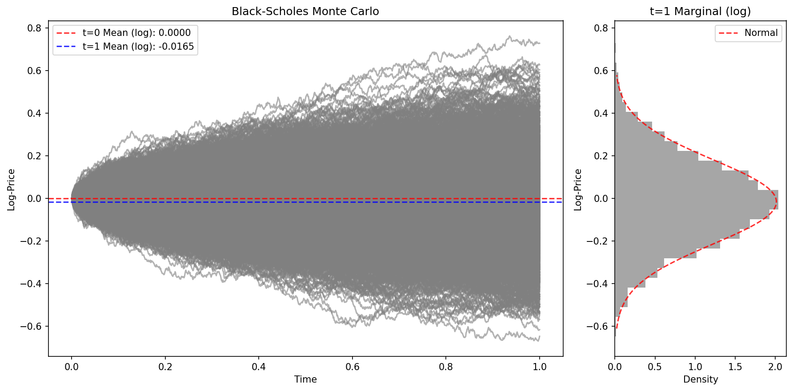

# RoughBench

**RoughBench** is a benchmark dataset for machine learning on rough differential equations.

# Equations

## Ornstein-Uhlenbeck (OU) Processes
The Ornstein-Uhlenbeck (OU) process is a classical mean-reverting stochastic process, governed by the SDE:
$$
dX_t = \theta (\mu - X_t) dt + \sigma dW_t,
$$
where $\theta$ is the rate of mean reversion, $\mu$ is the long-term mean, $\sigma$ is the volatility, and $W_t$ is standard Brownian motion.

### Standard OU
A batch of OU processes simulated with $\theta=0.5$, $\mu=0.0$, $\sigma=0.3$.

### Rough OU (Driven by Fractional Brownian Motion)
The rough OU process replaces standard Brownian motion $W_t$ with a fractional Brownian motion $B^H_t$ (with Hurst parameter $H < 0.5$), capturing rougher, more persistent path behavior:
$$
dX_t = \theta (\mu - X_t) dt + \sigma dB^H_t.
$$
Below is a simulation with $\theta=0.5$, $\mu=0.0$, $\sigma=0.3$, and Hurst parameter $H=0.7$.

## Rough Volatility

### Black Scholes
Black-Scholes is a fundamental model for option pricing that assumes the price of the underlying follows a geometric Brownian motion.

### Bergomi
The Bergomi model is a stochastic volatility model known for capturing volatility clustering. It extends classical models by including a stochastic process for the variance, incorporating memory effects commonly observed in financial markets.

### rBergomi
The rBergomi (rough Bergomi) model is an extension of the Bergomi model, introducing roughness in volatility paths using fractional Brownian motion. The roughness parameter (Hurst exponent) allows a more realistic fit to observed market volatility, especially in short-term smile/skew regimes.

